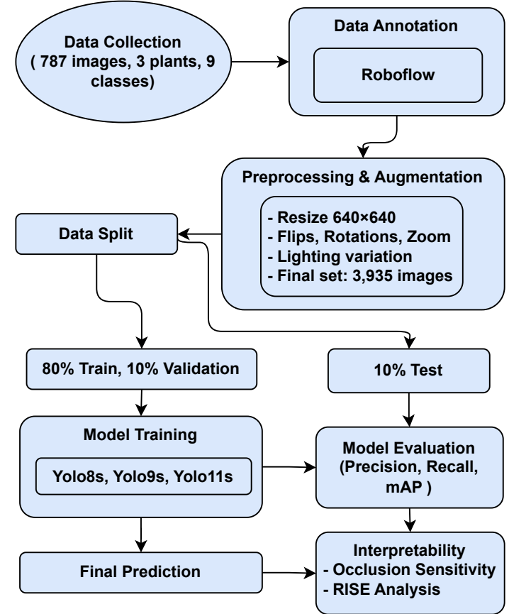
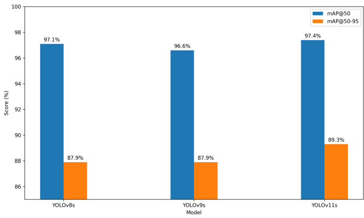
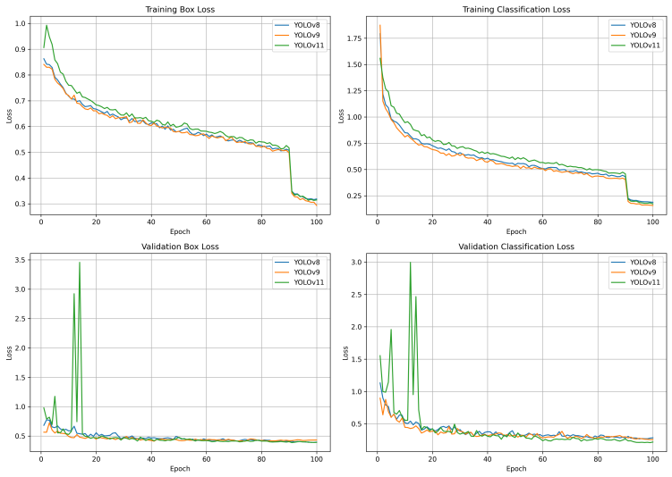
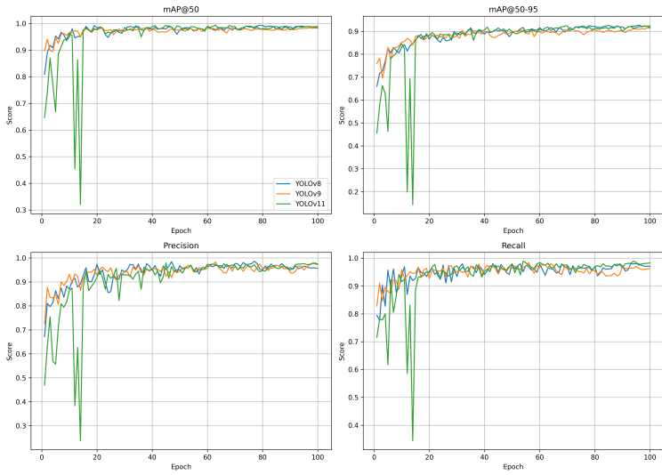
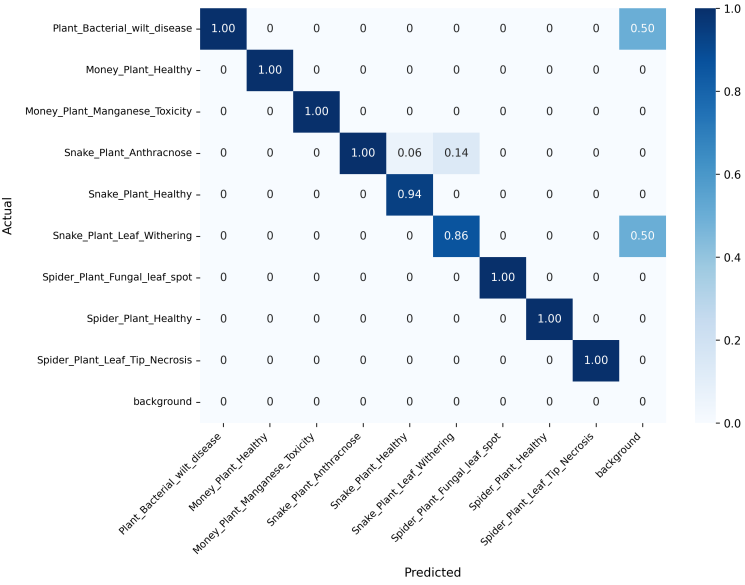
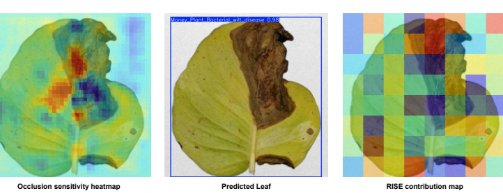

#  Deep Learning-Based Leaf Diseases Detection in Indoor Ornamental Plants: A Comparative Study of YOLOv8, YOLOv9, and YOLOv11

Nishad Mahmud Opu

Md Saiful Islam

Ruma Akter

Computer Science & Engineering Dept. Computer Science & Engineering Dept. Computer Science & Engineering Dept.

Sylhet Engineering College

Sylhet, Bangladesh

mahmudnishad253@gmail.com

Sylhet Engineering College

Sylhet, Bangladesh

saiful1616.islam@gmail.com

Sylhet Engineering College

Sylhet, Bangladesh

rumaakter39578@gmail.com

Kazi Maisha Jannath

Computer Science & Engineering Dept.

Sylhet Engineering College

Sylhet, Bangladesh

maishajannat388@gmail.com

Shahriar Ahmed

Computer Science & Engineering Dept.

Sylhet Engineering College

Sylhet, Bangladesh

sahmedcs21@gmail.com

Rakibul Islam Rafi

Computer Science & Engineering Dept.

Metropolitan University

Sylhet, Bangladesh

rakibulislamrafi36@gmail.com

Abstract—Accurate leaf disease detection in indoor ornamental plants remains a critical challenge due to reliance on subjective visual inspection and the high cost of molecular diagnostics. This work addresses the need for an efficient and lightweight system to monitor plant health and prevent disease spread in controlled environments. The main objective is to develop and evaluate a comprehensive end-to-end detection model, based on modern YOLO architectures, to identify and localize nine disease and healthy classes across three species: Money Plant, Snake Plant, and Spider Plant. A custom dataset of 787 high-resolution images was collected under variable lighting and backgrounds, annotated and expanded to 3,935 images via systematic augmentation. Three variants-YOLOv8s, YOLOv9s, and the YOLOv11s were trained on 640×640 inputs with AdamW optimization and evaluated using Precision, Recall, mAP 50, and mAP 50-95. YOLOv11s achieved superior performance, recording 97.4% mAP 50, 89.3% mAP@50-95, 93.7% Precision, and 96.7% Recall on the held-out test set. Class-wise analysis revealed consistently high recall, with minor confusions among visually similar disease symptoms. To enhance interpretability, occlusion sensitivity and RISE (Randomized Input Sampling for Explanation) analyses were employed, confirming that the model focuses on disease-relevant leaf regions while suppressing background features. The YOLOv11s framework delivers an accurate and interpretable solution for indoor plant disease monitoring, enabling early diagnosis and timely intervention in ornamental plant care.

Index Terms—indoor plant disease detection, object detection, yolov11, deep learning, machine learning, leaf disease

##  I. INTRODUCTION

Plant diseases cause substantial losses in agricultural productivity, directly affecting food security and farmer livelihoods [1]. Traditional detection methods, which rely on human expertise, are often subjective, error-prone, and inefficient when scaled to large farming systems. Advances in computer vision and deep learning (DL) have made automated plant dis-

ease detection a promising approach, offering rapid, accurate, and scalable solutions for practical applications. [2].

Although several deep learning models have been applied in this domain, challenges persist due to limited datasets, lack of standardized annotations, and insufficient interpretability of model predictions. Many existing works focus on single architectures or small-scale datasets, limiting their generalizability to diverse environments. Furthermore, the "black-box" characteristics of deep neural networks remain a source of concern about trust and transparency in agricultural applications [3].

Recent research has explored the use of advanced object detection architectures, such as the YOLO family, for multiclass leaf disease detection, demonstrating improved efficiency and accuracy in agricultural settings [4]. Building on this progress, the present study leverages YOLOv8s [5], YOLOv9s [6], and YOLOv11s [7] to address multi-class plant disease detection. A curated dataset of 787 images covering three plant species and nine distinct classes was carefully annotated and expanded through extensive preprocessing and augmentation techniques (resizing, flipping, rotation, zooming, and lighting variations), resulting in a final dataset of 3,935 images. Model training and evaluation were conducted using established metrics such as precision, recall, and mean average precision (mAP).

In addition, interpretability techniques such as occlusion [8] sensitivity and RISE [9] analysis were used to deliver deeper insights into model decision-making, ensuring reliability, practical applicability and Explainability [10]. Comparative analysis highlights the performance differences across YOLOv8s, YOLOv9s, and YOLOv11s, with particular emphasis on the improvements observed in YOLOv11s.

##  Objectives:

● Development of an augmented and annotated dataset for plant disease detection with improved diversity and

#  representativeness

● Implementation and comparative evaluation of YOLOv8s, YOLOv9s, and YOLOv11s models on multi-class plant disease detection

● Integration of interpretability methods (occlusion sensitivity and RISE analysis) to enhance transparency, trust, and real-world deployment potential

##  II. LITERATURE REVIEW

Historically, plant disease detection relied on farmers' and experts' visual examination, a subjective and error-prone process. Molecular diagnostic methods such as FISH, ELISA, PCR, and LAMP improved sensitivity and reliability but remain costly and time-consuming [11].

This research [12] examines machine learning (ML) and deep learning (DL) techniques for the detection, categorization, and severity assessment of agricultural diseases. Although conventional ML models such as SVM, KNN, Random Forest, and ANN have been employed, DL methodologies-particularly CNNs and transfer learning architectures like AlexNet, VGG16, ResNet, and Inception-have consistently attained superior accuracy (95-99% on datasets such as PlantVillage). Advanced models such as Faster R-CNN, SSD, YOLO, GANs, capsule networks, and vision transformers were examined. In summary, DL, especially CNNs and transfer learning, surpasses traditional ML methods in identifying plant diseases.

Object detection frameworks like YOLO (v4-v8) and Faster R-CNN, combined with backbones like ResNet, Inception-V3, VGG, DenseNet, and MobileNet, enabled multi-class detection across 14-22 species, achieving mAP scores of 92-98% and accuracies near 99.8% on datasets such as PlantVillage [13].

Lightweight solutions balance accuracy and efficiency. For example, integrating color segmentation with a three-block CNN reached 96.8% accuracy in detecting tomato, potato, pepper, and grape diseases, outperforming SVM and KNN while providing faster predictions [14].

Beyond food crops, ornamental and indoor plants have gained attention. A YOLOv5-based system for money plant disease achieved 93% accuracy with dataset augmentation, offering mobilefriendly deployment [15]. Further improvements using attention mechanisms, including ReXNet100 with Co-ordAttention, SPP, and CBAM modules, boosted performance from 88% to 99% accuracy, highlighting their importance for lightweight monitoring systems [16].

In this work, we used a YOLOv11-based detector for money plant, spider plant, and snake plant across nine healthy and diseased classes. Our end-to-end model uses bounding box annotations, robust augmentation, and comparative evaluation against YOLOv8 and YOLOv9, demonstrating superior precision, recall, mAP 50, mAP 50-95 and real-time scalability for efficient indoor plant disease monitoring.

#  III. METHODOLOGY

The methodology used in the conducted study takes a systematic approach to detecting indoor plant leaf disease with object detectors deep learning-based with an inclusive data

preparation plan. The format of the experimental pipeline is six, i.e, dataset collection, process of healthy leaf and disease locations annotation, preprocessing and augmentation, dataset splitting, model training, performance appraisal. These three variants of YOLO (YOLOv8, YOLOv9, and YOLOv11) were configured and trained, to be compared to ensure robustness. Occlusion sensitivity and RISE analyses were used to visualize the model's attention, highlighting important disease-related regions on the leaf surface. The general system will be to ensure sufficient performance of detection and shall measure the effect of various YOLO architectures as shown in Fig. 1.

Fig. 1. Workflow of the plant disease detection pipeline

#  A. Data Collection

Custom dataset was created consisting of three species of indoor plants; Money Plant, Snake Plant and Spider Plant. The dataset includes 787 high-resolution images in nine different categories: Money Plant Bacterial Wilt Disease (84 images), Money Plant Healthy (93), Money Plant Manganese Toxicity (84), Snake Plant Anthracnose (81), Snake Plant Healthy (89), Snake Plant Leaf Withering (86), Spider Plant Fungal Leaf Spot (87), Spider Plant Healthy (92) and Spider Plant Leaf Tip Necrosis (91). In each category, there are 81 to 93 images, which makes the data balanced. Photographs were taken in various plant nurseries in Sylhet City during normal daylight conditions and real changes in light and background were captured. In order to increase diversity of data, three smartphone

cameras were utilized offering different perspectives, scales and resolutions.

#  B. Dataset Annotation and Preprocessing

The dataset was prepared to be used in object detection by manually annotating all images on the Roboflow platform. Healthy leaves were marked and surrounded by a single bounding box around the whole leaf and marked with the appropriate class, like Money plant healthy. The diseased leaves were annotated, a single bounding box was placed on the whole leaf and labeled with the corresponding disease category, like Money Plant Manganese Toxicity. It enables the model to learn full-leaf disease classification. Images and annotations were all exported in YOLO format and resized to $640 \times 640$ pixels with padding to preserve aspect ratio.

#  C. Data Augmentation

In order to get around small original dataset size and enhance generalization, systematic augmentation pipeline was performed on the original 787 images and implemented on the Albumentations library [17]. The number of images that was made five times enriched a total of 3,935 images. Horizontal and vertical flipping to reproduce mirrored images, 90-degree clockwise and anti-clockwise rotations, and randomized rejection of parts of the picture including 20 percent zoom simulations to achieve half-leaf views and processed images. Photometric transformations such as brightness variation between -15 (15) and exposure variation between -10(10) were also used to simulate different illumination. These extensions were provided uniformly across all the classes, and the annotation of the bounding boxes was retained in the augmented images. The data were stored in the YOLO annotation format to be later trained.

##  D. Data Splitting

In order to have a balanced representation of all the classes, the augmented dataset of 3,935 images was split into the training, validation, and test sets. The train, validation and testing ratio were fixed at 80:10:10, and yielded 3148, 394 and 393 images respectively. To avoid the risk of data leakage, care was taken that images produced by the same leaf sample were not present in several subsets. The models were fit using the training set, hyperparameter tuning and early stopping were directed by the validation set and the held-out test set was held back for objective performance measures.

###  E. YOLO Model Configurations

In this experiment, the three state-of-the-art YOLO variants-YOLOv8, YOLOv9 and YOLOv11 were studied on indoor plant leaf disease detection. All models are trained with a comparable one-stage detection paradigm, which predicts the bounded boxes and the class probability jointly. As the main baseline, YOLOv11 brings together C3k2 block backbone with hierarchical extraction of features, the SPPF modules with multi-scale combining features, and the use of C2PSA spatial attention module to enhance feature representation. The

variants of YOLO otherwise have different backbone and head architectures, which gives one the comparative idea on the detection accuracy and generalization. Training was performed with 640x640 pixels standardised input size and optimisation with AdamW optimiser. Comparisons of performance were done by standard measures of object detection output, Precision, Recall and mean Average Precision (mAP) at varying levels of IoU.

#  F. Evaluation Metrics

The standard object detection measures were used to test the model performance; Precision, Recall, mAP 50 and mAP 50-95. Accuracy assesses how the share of the correctly predicted boxes in all of the predictions, and Recall assesses the share of the ground-truth boxes that are correct in the detection. mAP provides a summary of the detection performance at all classes and IoU thresholds and image-level accuracy evaluates the general accuracy across all the test images.

$$ \text{Precision} = \frac{TP}{TP + FP} \qquad (1) $$

$$ \text{Recall} = \frac{TP}{TP + FN} \qquad (2) $$

$$ \text{mAP} = \frac{1}{C} \sum_{i=1}^{C} AP_i \qquad (3) $$

Where TP is True Positives and FP is False Positives and FN is False Negatives and C is the total classes and $AP_i$ is the average precisions of class i. mAP@50 is computed with $IoU = 0.5$, whereas the average of mAP@50–95 is computed over the IoU thresholds 0.5 to 0.95. These metrics give a clear indication of how well the model can identify leaves, localise disease spots and classify leaf health correctly.

#  IV. EXPERIMENTS AND RESULTS

##  A. Experimental Setup

To evaluate detection performance, three YOLO variants-YOLOv8s, YOLOv9s and YOLOv11s were trained and tested on the augmented indoor plant leaf disease dataset. Models were trained on 640×640 input images with a batch size of 16 for 100 epochs using the AdamW optimizer. The training, validation, and test sets were used for model fitting, hyperparameter tuning, and final evaluation, respectively. Occlusion sensitivity and RISE were applied to visualize the regions contributing to model predictions, and performance was measured using Precision, Recall, mAP@50, mAP@50-95 and image-level accuracy.

##  B. Quantitative Results of All Models

The detection performance of YOLOv8s, YOLOv9s, and YOLOv11s was assessed on the test split of the augmented indoor plant leaf disease dataset. The results are summarized in Table I, reporting four standard evaluation metrics: mAP@50, mAP@50-95, Precision, and Recall.

TABLE I

TEST PERFORMANCE COMPARISON OF YOLO MODELS

| Model | mAP@50 | mAP@50-95 | Precision | Recall |
| --- | --- | --- | --- | --- |
| YOLOv8s | 97.1 | 87.9 | 92.2 | 96.5 |
| YOLOv9s | 96.6 | 87.9 | 92.9 | 96.2 |
| YOLOv11s | 97.4 | 89.3 | 93.7 | 96.7 |

In terms of localization accuracy at an IoU threshold of 0.5, YOLOv11s achieved the highest mAP@50 (97.4%), slightly outperforming YOLOv8s (97.1%) and YOLOv9s (96.6%). When evaluated across stricter thresholds (mAP@50–95), YOLOv11s again led with 89.3%, compared to 87.9% for both YOLOv8s and YOLOv9s, indicating superior robustness under varying overlap conditions.

For classification reliability, YOLOv11s also reached the highest Precision (93.7%), surpassing YOLOv8s (92.2%) and YOLOv9s (92.9%). Similarly, YOLOv11s obtained the highest Recall (96.7%), compared to 96.5% for YOLOv8s and 96.2% for YOLOv9s, confirming its ability to capture a greater proportion of true diseased regions without missing subtle lesions.

To provide a visual comparison, Fig. 2 presents a grouped bar chart of mAP@50 and mAP@50–95. The chart clearly highlights the advantage of YOLOv11s across both metrics, underscoring its superior performance for indoor plant leaf disease detection.

Fig. 2. mAP@50 and mAP@50–95 comparison across YOLO models, showing YOLOv11s as the top performer.

#  C. Training Dynamics

Fig. 3 illustrates the training and validation loss curves for the three variants of the YOLO model (YOLOv8, YOLOv9, YOLOv11), emphasising both box and classification losses throughout 100 epochs. The upper row presents the training box loss and classification loss curves adjacent to one another, illustrating consistent convergence across all models. All three variants demonstrate a swift decline in loss values during the initial epochs, succeeded by a gradual reduction as training advances, signifying effective learning and optimisation.

The bottom row displays the associated validation losses. Consistent with training trends, validation box and classifica-

Fig. 3. Training and validation loss curves for YOLOv8, YOLOv9, and YOLOv11 over 100 epochs, showing box and classification loss trends across models.

tion losses diminish over time, albeit with some fluctuations, especially in YOLOv11 during initial epochs, presumably attributable to early model instability or adjustments for overfitting. All models attain similarly low validation losses at convergence, indicating effective generalisation and negligible overfitting. This collective visualisation offers a thorough comparison of training dynamics and model stability, enabling direct evaluation of each YOLO variant's learning trajectory and its capacity to generalise from training to validation data.

Fig. 4 Validation performance metrics across training epochs for YOLOv8, YOLOv9, and YOLOv11 models. The four-panel comparative analysis presents critical evaluation metrics including mAP 50, mAP 50-95, precision, and recall throughout the training process. The mAP@50 and mAP@50-95 metrics quantify detection performance at different Inter- section over Union (IoU) thresholds, providing comprehensive accuracy assessment across varying localization requirements. Precision measures the model's ability to minimize false posi- tive detections, while recall evaluates the completeness of true positive identification. The convergence patterns demonstrate consistent learning trajectories and stable generalization capa- bilities across all three YOLO architectures, with YOLOv11 achieving the highest final mAP@50-95 performance of 0.916.

#  D. Class-wise Performance Analysis

To evaluate YOLOv11s performance at a granular level, detection metrics were calculated for each of the nine classes in the indoor plant leaf disease dataset. Table II summarizes per-class Precision, Recall, mAP@0.5, and mAP@0.5-0.95 on the held-out test split. As shown in Table II, all classes achieved uniformly high recall values (0.857) and strong mAP@0.5 scores (0.907). Money Plant Bacterial Wilt Disease, Money Plant Healthy, and Money Plant Manganese Toxicity each attained perfect recall (1.000) with high precision (0.938-0.986) and mAP@0.5 (0.991-0.995). Snake Plant Anthracnose demonstrated the lowest precision at 0.689, driven

Fig. 4. Validation mAP@50, mAP@50–95, precision, and recall curves for YOLOv8, YOLOv9, and YOLOv11 models across 100 epochs, illustrating the comparative evolution of detection accuracy and reliability during training.

by false positives, while Spider Plant Healthy recorded the lowest mAP@0.5-0.95 value of 0.789, indicating challenges in distinguishing subtle healthy-leaf variations. Overall, the mean per-class metrics were 0.937 for precision, 0.967 for recall, 0.974 for mAP@0.5, and 0.893 for mAP@0.5-0.95.

TABLE II PER-CLASS PERFORMANCE METRICS

| Class | Precision | Recall | mAP @0.50 | mAP @0.5-0.95 |
| --- | --- | --- | --- | --- |
| Money Plant Bacterial Wilt | 0.938 | 1.000 | 0.991 | 0.961 |
| Money Plant Healthy | 0.986 | 1.000 | 0.995 | 0.960 |
| Money Plant Manganese Toxicity | 0.986 | 1.000 | 0.995 | 0.966 |
| Snake Plant Anthracnose | 0.689 | 1.000 | 0.933 | 0.881 |
| Snake Plant Healthy | 0.993 | 0.944 | 0.990 | 0.952 |
| Snake Plant Leaf Withering | 0.919 | 0.857 | 0.966 | 0.799 |
| Spider Plant Fungal Leaf Spot | 1.000 | 1.000 | 0.995 | 0.870 |
| Spider Plant Healthy | 0.926 | 0.897 | 0.907 | 0.789 |
| Spider Plant Leaf Tip Necrosis | 0.994 | 1.000 | 0.995 | 0.856 |
| Overall Average | 0.937 | 0.967 | 0.974 | 0.893 |

Fig. 5 presents the normalized confusion matrix for class-wise prediction analysis, revealing inter-class relationships that complement the detection metrics in Table II. While the detection pipeline considers both localization and classification accuracy, the confusion matrix isolates classification performance to identify specific misclassification patterns. All three Money Plant categories-Bacterial Wilt, Healthy, and Manganese Toxicity-and the Spider Plant Leaf Tip Necrosis class achieved a perfect 1.00 classification rate, demonstrating clear separation from other categories. In contrast, Snake

Plant Anthracnose, despite perfect recall on its own class, was confused with Snake Plant Leaf Withering in 6% of cases and with Spider Plant Healthy in 14%, highlighting feature overlap between disease symptoms. Snake Plant Leaf Withering itself exhibited a 50% confusion rate with Spider Plant Healthy, while Spider Plant Healthy was mispredicted as Spider Plant Fungal Leaf Spot 50% of the time and also labeled as background in 50% of instances within the misclassified subset. These errors reflect the visual similarity of lesion patterns and subtle healthy-leaf textures and suggest that class-specific augmentation or additional symptom-level annotation could improve discrimination for Snake Plant and Spider Plant classes.

Fig. 5. Normalized confusion matrix for YOLOv11s on the nine-class leaf disease test set.

#  E. Model Interpretability Analysis

To better gain insight into the decision process of the YOLOv11 model, we performed occlusion sensitivity and RISE analyses. These methods provide visual explanations of which regions in the leaf images contribute most to disease detection, enhancing model transparency and trustworthiness.

The occlusion sensitivity analysis systematically masks different regions of the leaf image to observe their effect on model predictions. The resulting heatmaps in Fig. 6 highlight distributed regions across the leaf surface (red/orange areas), demonstrating that YOLOv11 considers global leaf features rather than focusing solely on localized lesions. This suggests that the model effectively ignores background elements while leveraging the entire leaf morphology for disease detection.

RISE (Randomized Input Sampling for Explanation) generates pixel-level contribution maps, revealing the importance of individual pixels in the detection decision. As shown in Fig. 6, higher importance values (red/orange) are concentrated on the leaf tissue areas, indicating that YOLOv11 focuses on relevant botanical features while suppressing background noise. This supports the robustness of the detection approach

and highlights potential areas for improvement in emphasizing disease-specific features.

Fig. 6. Occlusion sensitivity heatmap and RISE contribution map for YOLOv11 on a representative leaf image. Red/orange regions indicate areas most critical for disease detection.

#  V. CONCLUSION

This work presented a comprehensive framework for detecting and classifying indoor plant leaf diseases using modern YOLO object detection models. A carefully curated dataset of Money Plant, Snake Plant, and Spider Plant was collected, annotated and systematically augmented to ensure robustness and diversity. Comparative evaluation of YOLOv8s, YOLOv9s, and YOLOv11s demonstrated that the YOLOv11s model consistently achieved superior results across all metrics, attaining 97.4% mAP@50, 89.3% mAP@50–95, 93.7% precision, and 96.7% recall. Class-wise analysis further revealed high recall across all categories, with some confusion persisting in visually similar Snake Plant and Spider Plant classes, highlighting opportunities for class-specific refinement.

In addition to strong quantitative performance, occlusion sensitivity and RISE analyses provided interpretability by revealing the spatial and pixel-level regions most influential to model predictions. These visualizations demonstrated that YOLOv11s attends primarily to leaf tissue areas while suppressing background interference, underscoring the system's robustness and reliability for real-world deployment. Overall, the YOLOv11s framework offers a lightweight and accurate solution for indoor plant disease monitoring, suitable for integration into precision agriculture and mobile-based plant care systems. Future research will aim to enlarge the dataset with more plant species, incorporating temporal disease progression tracking, and exploring transformer-based hybrid models to further enhance detection robustness and interpretability.

#  REFERENCES

[1] J. Flood, "The importance of plant health to food security," Food Security, vol. 2, no. 3, p. 215–231, Jul. 2010. [Online]. Available: https://doi.org/10.1007/s12571-010-0072-5

[2] A. Upadhyay, N. S. Chandel, K. P. Singh, S. K. Chakraborty, B. M. Nandede, M. Kumar, A. Subeesh, K. Upendar, A. Salem, and A. Elbeltagi, “Deep learning and computer vision in plant disease detection: a comprehensive review of techniques, models, and trends in precision agriculture,” Artificial Intelligence Review, vol. 58, no. 3, Jan. 2025. [Online]. Available: https://doi.org/10.1007/s10462-024-11100-x

[3] L. Santos, F. N. Santos, P. M. Oliveira, and P. Shinde, “Deep learning applications in agriculture: A short review,” Advances in Intelligent Systems and Computing, p. 139–151, Nov. 2019. [Online]. Available: https://doi.org/10.1007/978-3-030-35990-4_12

[4] F. Hu, M. Abula, D. Wang, X. Li, N. Yan, Q. Xie, and X. Zhang, “Investigation of an efficient multi-class cotton leaf disease detection algorithm that leverages yolov11,” Sensors, vol. 25, no. 14, p. 4432, Jul. 2025. [Online]. Available: https://doi.org/10.3390/s25144432

[5] G. Jocher, A. Chaurasia, and J. Qiu, “Ultralytics yolov8,” 2023. [Online]. Available: https://github.com/ultralytics/ultralytics

[6] C.-Y. Wang and H.-Y. M. Liao, “Yolov9: Learning what you want to learn using programmable gradient information,” 2024.

[7] G. Jocher and J. Qiu, “Ultralytics yolo11,” 2024. [Online]. Available: https://github.com/ultralytics/ultralytics

[8] M. D. Zeiler and R. Fergus, “Visualizing and understanding convolutional networks,” in Computer Vision – ECCV 2014, ser. Lecture Notes in Computer Science, D. Fleet, T. Pajdla, B. Schiele, and T. Tuytelaars, Eds., vol. 8689. Cham: Springer International Publishing, 2014, pp. 818–833. [Online]. Available: https://cs.nyu.edu/ fergus/papers/zeilerECCV2014.pdf

[9] V. Petsiuk, A. Das, and K. Saenko, “Rise: Randomized input sampling for explanation of black-box models,” Jun. 2018. [Online]. Available: https://arxiv.org/abs/1806.07421

[10] S. A. Ali, K. R. Arain, N. U. A. Mushtaq, and O. U. Rehman, "Interpretable deep learning for brain tumor diagnosis: Occlusion sensitivity-driven explainability in mri classification," VFAST Transactions on Software Engineering, vol. 13, no. 2, p. 135–146, May 2025. [Online]. Available: https://doi.org/10.21015/vtse.y13i2.2082

[11] M. A. John, I. Bankole, Ó. Ajayi-Moses, T. Ijila, T. Jeje, and P. Lalit, “Relevance of advanced plant disease detection techniques in disease and pest management for ensuring food security and their implication: a review,” American Journal of Plant Sciences, vol. 14, no. 11, p. 1260–1295, Jan. 2023. [Online]. Available: https://doi.org/10.4236/ajps.2023.1411086

[12] H. N. Ngugi, A. E. Ezugwu, A. A. Akinyelu, and L. Abualigah, “Revolutionizing crop disease detection with computational deep learning: a comprehensive review,” Environmental Monitoring and Assessment, vol. 196, no. 3, Feb. 2024. [Online]. Available: https://doi.org/10.1007/s10661-024-12454-z

[13] L. Li, S. Zhang, and B. Wang, “Plant disease detection and classification by deep learning—a review,” IEEE Access, vol. 9, p. 56683–56698, Jan. 2021. [Online]. Available: https://doi.org/10.1109/access.2021.3069646

[14] S. V. Militante, B. D. Gerardo, and N. V. Dionisio, "Plant leaf detection and disease recognition using deep learning," 2019 IEEE Eurasia Conference on IOT, Communication and Engineering (ECICE), Oct. 2019. [Online]. Available: https://doi.org/10.1109/ecice47484.2019.8942686

[15] M. Khalid, M. S. Sarfraz, U. Iqbal, M. U. Aftab, G. Niedbała, and H. T. Rauf, “Real-time plant health detection using deep convolutional neural networks,” Agriculture, vol. 13, no. 2, p. 510, Feb. 2023. [Online]. Available: https://doi.org/10.3390/agriculture13020510

[16] P. Nasra, J. Singh, S. Rani, G. Shandilya, S. Bharany, S. Sood, A. U. Rehman, and S. Hussen, “Optimized rexnet variants with spatial pyramid pooling, coordattention, and convolutional block attention module for money plant disease detection,” Discover Sustainability, vol. 6, no. 1, May 2025. [Online]. Available: https://doi.org/10.1007/s43621-025-01241-6

[17] A. Buslaev, V. I. Iglovikov, E. Khvedchenya, A. Parinov, M. Druzhinin, and A. A. Kalinin, “Albumentations: fast and flexible image augmentations,” Information, vol. 11, no. 2, p. 125, Feb. 2020. [Online]. Available: https://doi.org/10.3390/info11020125
